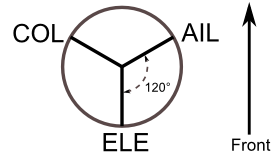
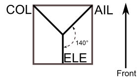
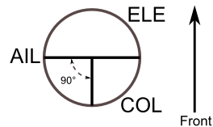

..

Advanced Topics
===============

.. _setting-up-a-buddy-box:

Setting up a Buddy-Box
----------------------
Deviation can be used to act as either the instructor (master) or student (slave) transmitter in a buddy-box configuration.  In this mode, the instructor and student connect their respective transmitters together with a trainer cord via the DSC port.  The instructor’s transmitter will actually communicate with the model, but the instructor can use a switch to allow the student to control the model.  When the switch is enabled, the student’s transmitter sends input (stick) information through the trainer cord to the instructor’s transmitter and these inputs replace the instructor’s inputs.

Deviation can be configured to work with virtually any transmitter that supports either master or slave mode.  Matching Deviation to a different manufacturer requires knowing the PPM parameters for the paired transmitter, and properly configuring the ‘Center PW’ and ‘Delta PW’ properly as well as knowing how many channels are transmitted and what the channel ordering is.  The best place to find this information is to ask on the www.deviationtx.com forums.

Master Mode
~~~~~~~~~~~
Master mode is configured by selecting either ‘Channel’ or ‘Stick’ from the ‘PPM In’ spin-box in section :ref:`model-setup`. Pressing ‘ENT’ on either ‘Stick’ or ‘Channel’ will show the ‘Trainer Cfg’ pages. The 2 modes behave slightly differently:

.. image:: images/|target|/ch_advanced/master_stick.png
   :align: center

**Stick**: In stick mode, each input channel is mapped to a stick on the master transmitter.  In this mode, the student moving the stick will behave exactly as if the instructor had moved the stick. Generally when using this mode, the student’s transmitter will directly pass the stick position (no mixing) and the instructor’s transmitter will do all necessary mixing.

.. image:: images/|target|/ch_advanced/master_channel.png
   :align: center

**Channel**: In channel mode, each input channel is mapped to an output channel on the instructor’s transmitter.  In this mode, the student’s transmitter should do all necessary mixing to control the model.  Care must be taken to ensure that the instructor and student transmitters are configured identically, otherwise, the model may not react well when switching between instructor and student control.

Options configurable on both Trainer Cfg pages:

* **Center PW**: Defines the time (in µsec) of the pulse that the student’s transmitter transmits to represent centered servo position.  If this number doesn’t match the students transmitter, the servos will not be centered

* **Delta PW**: Defines the width of the pulse (measured from center) sent by the student’s transmitter to define max servo throw.  If this value is incorrect, the servos will not achieve full range (or will travel too much)

* **Trainer Sw**: Defines the switch that enables the student to take control of the model

* **PPM1...PPM8**: Defines the mapping (either channel or input) from the student’s transmitter to the instructor’s

Slave Mode
~~~~~~~~~~
Slave mode is configured by choosing ‘PPM’ as the protocol in section :ref:`model-setup`.  Pressing ‘ENT’ on the Protocol spin-box will enable setting the output options.  See section :ref:`protocol-ppm` for configuration.  Note that Deviation will send the channel output data through the PPM.  To use a Deviation slave transmitter with a Deviation Master configured for ‘Stick’ mode (see above), there should be no mixing done in the slave transmitter.

.. _setting-up-fpv:

Setting Up FPV or Other External Inputs
---------------------------------------

.. image:: images/|target|/ch_advanced/ppmin_extend.png
   :align: center

Deviation has the ability to use PPM input signals from an external source (such as an FPV setup).  To configure this mode, set the PPM In mode to ‘Extend’ in section :ref:`model-setup`.

Once enabled, press ‘ENT’ on the PPM In spin-box to configure the additional inputs.

Configuration options:

* **Center PW**: Defines the pulse-width for a centered input (in µsec).
* **Delta PW**: Defines the difference in pulse-width (from the center value) to reach min/max servo throw
* **Num Channels**: Defines the number of channels to input (generally no more than 8 can be supported)

.. _trim-as-virtual-switch:

Using a Trim as a Virtual Switch
--------------------------------
Deviation has the capability to create virtual switches to supplement the mechanical switches of the transmitter.  This capability is only available when using the Advanced GUI.  There are 3 types of switches available:

* **Momentary**: The switch will be active only as long as the trim button is held
* **Toggle**: The switch will toggle from on-to-off or off-to-on each time the trim button is pressed
* **On/Off**: The Trim+ button will turn the switch on, and the 'Trim-' button will turn it off-to-on
* **3 Pos**: The switch will be active in one direction as long as the Trim+ button is held, and in the other direction as long as the Trim- button is held, returning to center when released.

To setup a virtual switch, start by selecting the trim from the 'Trim' page, and entering the trim-setup page.  See :ref:`trims-and-virtual-inputs`

.. image:: images/|target|/ch_advanced/virtsw.png
   :align: center

Next set the 'Trim Step' field to 'Momentary', 'Toggle', 'On/Off' or '3 Pos'.  This is done by pressing the left-arrow on the 'Trim Step' spin-box until the value is less-than 0.1
Second select the 'Input' to be the virtual channel to convert to a switch (we'll use 'Virt1')

.. image:: images/|target|/ch_advanced/virtsw2.png
   :align: center

.. container::

   Now go to the 'Mixer' page, and enter the configuration for the specified Virtual Channel (Virt1 in our example)

   Set the mixer-type to 'Complex', set the 'src' to the current virtual channel ('Virt1'), set the curve to '1-to-1' (Do NOT use 'Fixed'), set the scale to '0', and finally enable the 'Trim' button.

You can now use the virtual channel ('Virt1') like any other switch input.  When the virtual switch is active, the virtual channel will have a value of 100, otherwise it will have a value of -100.  In the case of '3 Pos', virtual channel will have a value of -100 when trim is pressed in one direction, +100 when pressed in the other direction, otherwise it will have a value of 0.

\

.. cssclass:: bold-italic

Note: If you use the virtual channel as a 'Src' (as opposed to a 'Switch') make sure that 'trim' is disabled for that mixer, otherwise the trim will be applied twice.

.. _swash-mixing:

Swash Mixing
------------
A swash-plate is used to control flight on an RC helicopter.  The swash-plate controls the plane of rotation of the main-rotor as well as the blade pitch.  A swash plate is normally connected to 3 servos known as Elevator, Aileron, and Collective, but due to its design, there is not a 1-to-1 correspondence between stick-movement and the servo movement.  Instead some mixing is necessary between the throttle, elevator and aileron sticks and the swash-plate servos.  This mixing is known as cyclic Collective Pitch Mixing (CCMP).

Traditionally, RC helicopters have used a flybar above or below the main rotor attached to a series of linkages to maintain stability.  In these setups, the transmitter will normally do all of the mixing, and directly drive each of the 3 swash-plate servos.  This configuration is known as manual-CCPM (mCCPM).  Alternatively, an electronic mixer can be included on the helicopter either as part of the receiver, or between the receiver and servos, that can implement the proper mixing.  This configuration is known as electronic CCPM (eCCPM) and in this case, the transmitter directly supplies aileron, elevator, and collective inputs, and the electronic mixer will convert the signals into appropriate swash-plate servo motion.

Recently, flybarless (FBL) helicopters have become more common, especially in the micro size range.  These helicopters use an eCCPM system along with an electronic gyroscope to continuously adjust the swash-plate to maintain stability without the need for a physical flybar.  This setup tends to be less expensive to manufacture, and also provides better stability and more precise control.

Deviation provides control for several swash-plate layouts, these include: 120°, 120° Alternate, 140°,  90°, and None. Each of these options are illustrated below:

**120 (3 Servo)**: Servos are placed around the swash-plate at 120° intervals. With Aileron input, the aileron and pitch servos tilt the swash-plate left and right; with Elevator input, the three servos tilt the swash-plate fore and aft; with Pitch input, all three servos raise the swash-plate up and down. Servos working in unison dramatically increases the torque available as well as the precision and centering.

.. image:: images/common/ch_advanced/swash_120x.png
   :align: center

**120X (3 Servo)**: Same as the above layout except servos are shifted 150°. With Aileron input, the three servos tilt the swash-plate left and right; with Elevator input, the elevator and pitch servos tilt the swash-plate fore and aft; with Pitch input, all three servos raise the swash-plate up and down.

**140 (3 Servo)**: Fundamentally, the servo operations of 140° swash-plates are almost the same as 120° swash-plates. However, the servo arrangement for elevator operation differs. 140° swash-plate CCPM offers smoother operation of the combined servos and an equal cyclic rate all around. On a 120° setup, the left/right cyclic is slightly faster than the fore/aft cyclic.

**90 (3 Servo)**: With Aileron input, the aileron and pitch servos tilt the swash-plate left and right; with elevator input, the servos tilt the swash-plate fore and aft; with Pitch input, all three servos raise the swash-plate up and down. Most commonly used for electronic helicopters.

**None**: This is a special case where all mixing is done on-board the helicopter using a gyroscopic flight control system. Please refer to the specific manufacturers instructions to see how to configure mixer outputs.

\

.. cssclass:: bold-italic

Note: Some helicopters are 120 or 140, except rotated 180 degrees. In these cases you will still use the designated swash-plate type but may need to reverse specific channels.

.. _modifying-sounds:

Modifying sounds
----------------

You can edit the sounds your Devo makes, though you have to do it
by mounting the transmitter as a USB drive and editing the 'sound.ini'
file in the 'media' folder.

The sections, and what causes them to play, are:

* **startup**: Powered on.
* **shutdown**: Powering off.
* **volume**: Configuring transmitter volume.
* **timer_warning**: Timer is about to expire.
* **alarm#**: Timer # (1 to 4) has expired.
* **batt_alarm**: Battery low warning.
* **done_binding**: Binding finished.
* **key_pressing**: On a key press
* **saving**: When saving a model file.
* **max_len**: When you've exceeded the length of a string in the keyboard.
* **telem_alarm#**: Telemetry alarm # (1 to 6) has triggered.

In each section, you can adjust set 'volume' from 0 (off) to 100
(max). The rest of the entries are note names, and the value is the
number of milliseconds to play that note. There is a limit of 100
notes for each sound.

The note names are 'xx', which is a rest (no sound played). You can
then pick a note ('a'-'g'), possibly sharped by adding a 'x' if it's
'a', 'c', 'd', 'f' or 'g'. Finally, you can choose an octave with a
single digit, ranging from '0' to '4'. Those take you from 'c0'
(middle C) up to 'b4'. In addition, 'a', 'ax' and 'b' will play the
three notes below middle C.
