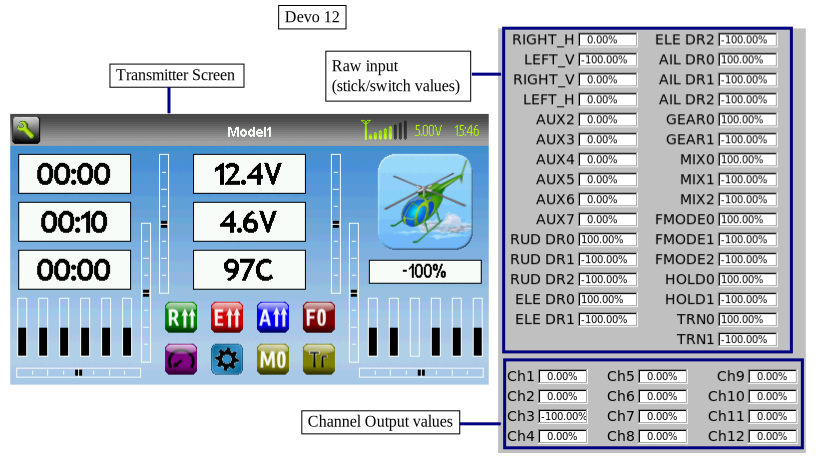
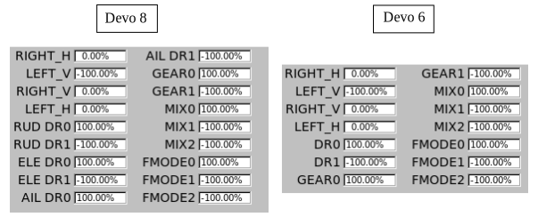
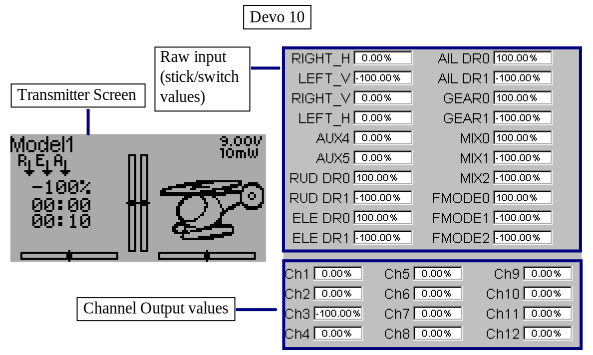

..

Emulator
========
The emulator provides a way to test Deviation on your PC without uploading the firmware to your transmitter.  It provides a visual display equivalent to that of the transmitter along with a side-screen displaying the current virtual-stick/switch states as well as the Channel output that would be received by the servos.

Download and unzip the deviation-emu_devoXX-vx.y.z.zip emulator package from:

 http://www.deviationtx.com/downloads-new/category/1-deviation-releases/

where XX is the number of your Devention transmitter. x.y.z identifies the deviation version number. Normally you should use the latest one. To start the emulator just run the exe file in the sub-directory.

.. if:: devo8

.. elseif:: devo10

.. endif::

The emulator controls are as follows (based an an English QWERTY keyboard):

.. cssclass:: emutable

============== ============================================= ========== ========== ===========
  Keyboard      Function                                         Transmitter                  
-------------- --------------------------------------------- ---------------------------------
.. if:: devo8
  \                                                              12         8          6      
.. elseif:: devo10
  \                                                              12e        10         7e     
.. endif::
============== ============================================= ========== ========== ===========
  q/a           Left-Vertical stick (Throttle in mode 2)         X          X          X      
  Q/A           Left-Vertical trim                               X          X          X      
  w/s           Left-Horizontal stick (Rudder in mode 2)         X          X          X      
  W/S           Left-Horizontal trim                             X          X          X      
  e/d           Right-Vertical stick (Elevator in mode 2)        X          X          X      
  E/D           Right-Vertical trim                              X          X          X      
  r/f           Right-Horizontal stick (Aileron in mode 2)       X          X          X      
  R/F           Right-Horizontal trim                            X          X          X      
.. if:: devo8
  o/l           AUX2                                             X                            
  p/;           AUX3                                             X                            
  t/g           AUX4                                             X                            
  T/G           Top-Left trim                                    X          X                 
  y/h           AUX5                                             X                            
  Y/H           Top-Right trim                                   X          X                 
  u/j           AUX6                                             X                            
  i/k           AUX7                                             X                            
  z             Gear                                             X          X          X      
  x             Rudder Dual-Rate switch                          X          X                 
  c             Elevator Dual-Rate switch                        X          X                 
  v             Aileron Dual-Rate switch                         X          X          DR     
  b             Mix 0/1/2 switch                                 X          X          X      
  n             FMode 0/1/2 switch                               X          X          X      
  m             Hold switch                                      X                            
  ,             Train switch                                     X                            
.. elseif:: devo10
  t/g           AUX4                                             X          X
  T/G           Top-Left trim                                    X          X                 
  y/h           AUX5                                             X          X                  
  Y/H           Top-Right trim                                   X          X                 
  u/j           AUX6                                             X                            
  i/k           AUX7                                             X                            
  z             Gear                                             X          X          FMODE
  x             Rudder Dual-Rate switch                          X          X          HOLD   
  c             Elevator Dual-Rate switch                        X          X                 
  v             Aileron Dual-Rate switch                         X          X                 
  b             Mix 0/1/2 switch                                 X          X                
  n             FMode 0/1/2 switch                               X          X                
.. endif::
  \\            Power off                                        X          X          X      
  Left-arrow    Left                                             X          X          X      
  Right-arrow   Right                                            X          X          X      
  Up-arrow      Up                                               X          X          X      
  Down-arrow    Down                                             X          X          X      
  Enter         Ent                                              X          X          X      
  Escape        Exit                                             X          X          X      
============== ============================================= ========== ========== ===========

