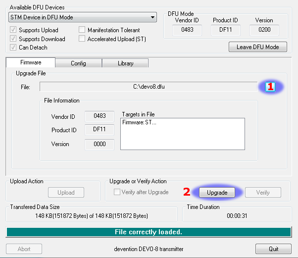

Installation
============

Windows™ users can choose between two methods of installing the deviation firmware.

1) Use the Deviation Uploader tool
2) Use the Walkera DfuSe USB Upgrade tool (Windows™ only)

If you do not have the Windows™ operating system, go with the first choice, the Deviation Uploader tool. It is a Java application that was designed by the Deviation developer team to be efficient and simple to use with any Devo radio and any version of deviation or even Devention, if you should wish to revert to the original Walkera firmware. The Walkera tool uses a two-step approach, in which you first install the firmware, then the filesystem library. The Deviation Uploader tool does the same thing in one simple, convenient step, using the ZIP compressed deviation firmware file as the source.

.. if:: devo10
If your transmitter is a Devo F7 or F12E, you **must** use the Deviation
Uploader.
.. endif::

The :ref:`preparation` section covers things you need to do before
starting an installation. Then, two installation sections cover the
actual installation, depending on which tool you are using. There are
sections following that include notes specific to upgrading from or to
various versions and build types.

.. _preparation:

Preparation
-----------

First, ensure that your Devo is fully charged before starting the installation. Download the deviation-devoXX-x.y.z.zip firmware from
http://deviationtx.com/downloads-new/category/1-deviation-releases
where XX is the number of your Walkera Devo™ transmitter. x.y.z
identifies the deviation version number.

.. cssclass:: bold-italic

NOTE: Do NOT attempt to use the DfuSe tool from STMicroelectronics!

You can download the Walkera tool from:
https://drive.google.com/drive/u/0/folders/0B6SupsT8-3_BYXNQM1dOUlRYcGM

The Deviation Uploader tool can be downloaded from
http://deviationtx.com/downloads-new/category/161-dfu-usb-tool

If you are using Windows™, you need to install the appropriate
USB drivers. See the section on :ref:`windows_drivers`

Unzip the tools and install them locally. If you are using the Deviation Uploader tool, it is not necessary to unzip the firmware you downloaded. It is recommended that you
test the DFU tool by first upgrading your TX to a different version of Walkera firmware.

If you are upgrading from a previous Deviation release, it is strongly
recommended that you back-up the 'models' directory from the
transmitter as well as the 'tx.ini' and the 'hardware.ini' files to
ensure you don’t lose any model or transmitter configuration.

.. _windows_drivers:

Windows Driver Installation
~~~~~~~~~~~~~~~~~~~~~~~~~~~

The Walkera DfuSe tool and the Deviation Uploader tool use different
drivers. Both can be installed by the Deviation USBDrv Installer,
available from
http://www.deviationtx.com/downloads-new/category/161-dfu-usb-tool

.. cssclass:: bold-italic

Extract the Deviation USBDrv Installer, and run 'DFU USBDrv
Installer-x.y.exe'. You can then uninstall both drivers, or install
either the Deviation USB Driver for use with the Deviation
Uploader or the Walkera driver. Install the driver for the Dfu tool you plan on using.

DFU Installation With Walkera DfuSe
-----------------------------------

Installation of Deviation with the Walkera DfuSe tool is done in
exactly the same manner as upgrading the Walkera Devention firmware.
Note that Deviation will NOT overwrite Walkera models stored on the
transmitter. While they cannot be accessed by Deviation, they will be
safely preserved should the Walkera firmware ever need to be
reinstalled

.. cssclass:: bold-italic

.. if:: devo10
NOTE: As a result of memory limitations with the Devo7e, Devo F12e
and Devo F7 firmware, the original models will be lost when switching
to Deviation.
.. endif::

Unzip the firmware file that you downloaded earlier.
Plug the transmitter into the PC via USB, and turn on the transmitter while holding ‘EXT’ to enter programming mode.
.. if:: devo8
On the Devo12, this is done by holding the trainer switch instead.
.. endif::

Several users have reported compatibility issues with Windows™ and/or USB ports when running this tool. If DfuSe does not recognize your TX, try removing all USB devices and restart your PC with only the USB connection to the TX. Take the steps necessary to resolve any connection issues.

If your transmitter has been connected correctly 'STM Device in DFU Mode' will be displayed under 'Available DFU Devices'. Otherwise this field will remain blank.

1) Press the '…' button and select the deviation-devoXX-vx.y.z.dfu file to install.
2) Select '**Upgrade**' to install the firmware. This will be grayed-out if your transmitter is not detected.  **Do NOT use 'Upload' as this will destroy the dfu file on your PC.**
.. if:: devo8
3) **Devo12 Only**: Select the 'Library' tab, click '…' select the devo12-lib.dfu from the zip file.  Then select '**Upgrade**' again to install the library.
.. endif::

Turn off the transmitter, and turn back on while holding 'ENT'. There should be a USB logo on the screen. If this is a first-time install of Deviation, the PC should prompt to format a drive. Format using default options. Next, upgrade the file system via USB.

Upgrading the file system via USB
---------------------------------

.. if:: devo10
.. cssclass:: bold-italic

   On the Devo F7 and F12E, do not enable USB mode, as the file system
   cannot be accessed from the desktop, and you need to use the 'File
   Manager' tab on the 'Deviation Uploader' to manage files. If you
   enable it, all you can do is format the drive, which will destroy
   your installation.
.. endif::

Open the folder that has been extracted from the zip file and copy all the files and directories
inside this folder to the root of the transmitter USB drive. For
details of the file-system please see :ref:`usb-file-system`. The
files with the extension 'zip', and 'dfu' need not to be copied.

.. image:: images/|target|/ch_install/dont_copy_files.png
   :height: 6cm

If you are upgrading from an older release, don't upgrade the 'tx.ini',
and 'hardware.ini' files or the 'models' directory. Optionally, copy
the 'models' directory to the transmitter except for the currently
configured model files. This last step will ensure that the defaults
for newly created models have the latest options set. If the 'tx.ini'
file is overwritten, the stick calibration must be repeated and any
settings reset.

DFU Installation with Deviation Uploader
----------------------------------------

.. cssclass:: bold-italic

The 'Deviation Uploader' is a Java (jar) file. You can
either pass the jar file to the Java executable on the command line,
or open the file in the GUI, using the Java application to open it. You will need to install Java from http://www.java.com/ if you haven't already installed it.

.. if:: devo8
Once the 'Deviation Uploader' is open, connect your transmitter to a
USB port, and then turn it on while holding down the 'EXT' button.
On the Devo 12, this is done by holding the trainer switch instead.
.. endif::
.. if:: devo10
Once the 'Deviation Uploader' is open, connect your transmitter to a
USB port, and then turn it on while holding down the 'EXT' button.
.. endif::

If everything is working properly, you should see the 'Transmitter'
change to the type of the connected transmitter. If it changes to the
wrong transmitter type, stop now and seek help from the forums. If it
doesn't change, check the system information to see if the device is
listed at all. If it shows up as an unknown device on Windows, then
check your driver installation and try unplugging all other USB
devices. Take the steps necessary to resolve any connection issues.

1) Press the '…' button and select the zip file for the firmware you will install. There is no need to unpack the zip file since the Deviation Uploader will handle that.
.. if:: devo8
2) If this is an initial install, all the 'Replace' boxes, along with 'Format' will be preselected.
.. endif::
.. if:: devo10
2) If this is an initial install, all the 'Replace' boxes, along with 'Format' will be preselected.
   On the Devo F7 and Devo F12E initial install, select the 'Format'
   check box if not already selected.
.. endif::
3) Click the 'Install/Upgrade' option. Installation will take a few minutes, so be patient. A pop-up dialog box will notify you when installation is completed. You are done. 
4) Turn off your Devo transmitter. When you turn it on again, you'll be greeted by the Deviation splash screen.

.. if:: devo10

.. cssclass:: blod-italic

   On the F7 and F12E, do not enable USB mode, as the
   file system cannot be accessed from the desktop, and you need to
   use the 'File Manager' tab on the 'Deviation Uploader' to manage files.
.. endif::

For transmitters other than the F7 and F12E, turn the transmitter back on while holding 'ENT'. There should be a USB logo on the screen. If this is a first-time install of Deviation, your computer may prompt to format a drive. Format using default options.

Upgrading the file system with Deviation Uploader
-------------------------------------------------
.. if:: devo10
.. cssclass:: bold-italic

The Devo F7 and F12E do not support access via USB. Do not turn it on,
as formatting the disk from your desktop will destroy your deviation
installation.

.. endif::

If you followed the foregoing instructions for installing the deviation firmware ZIP file for your Devo using the Deviation Uploader tool, your installation is complete and no further installations are necessary. If, on the other hand, you unzipped the file and installed the firmware dfu file alone, then your must continue by installing the library dfu file from the same location. There is no advantage in doing the installation this way, but it can be done.

Deviation 5.0
---------------

The long-awaited firmware update from version 4.0.1 to version 5.0 was accomplished on April 30, 2016 and was announce on the DeviationTx website forum. Deviation version 5.0 is the current version and it includes all patches, bug fixes, improvements and protocols of the previous version. Even so, development continues, so new controllers will be added to the support list as well as new protocols and features, when they become available.

Nightly Deviation Builds
------------------------

The Nightly builds are versions of Deviation with additional features
beyond the Deviation 5.0 release version.  The Nightly builds are
provided to allow the Deviation community to fully exercise new
features so the community can provide feedback and suggestions for
improvement.  As a user, you recognize that Deviation is a community
supported software system, and members of this community can
contribute by verifying, validating or commenting on the features that
they've used. Nightly builds are found at
http://www.deviationtx.com/downloads-new/category/13-nightly-builds

These builds are published when new features are added to the
Deviation core feature set, when major bugs are corrected and when new
hardware support is added.  The nightly builds are tested but not to
the rigorous extent of a full release.  Please read this post!
http://www.deviationtx.com/forum/5-news-announcements/1416-nightly-builds

The ONLINE User Manual for Deviation is regularly reviewed and updated
to include information about new common features.  Additionally, while
best efforts are made by the Deviation community to update these User
Guides, this documentation MAY NOT fully describe the features of the
nightly builds.  Any Deviation user with an update or change to the
manual can submit additions and changes via the Deviation Bug Tracker
at http://deviationtx.com/mantisbt

So should you load the Deviation 5.0 release or should you load a
Nightly?  Your own requirements will determine the answer to that
question.  If you use Walkera, Spectrum and Flysky models, and any
number of variations of the WLToys V2x2 quads, the Deviation 5.0
release will be sufficient.  If you have one of many newer small
quads, or if you want support for additional hardware beyond
additional transmitter modules, you should consider using the Nightly
build.

If you are also adding hardware modifications, such as switches or
transmitter modules, you should install the Deviation Nightly build
first and review the available features.  After Deviation is running,
install your hardware and modify any settings to support your
modifications.  This helps you determine the source of issues later
for troubleshooting.

Test Builds
-----------

Test Builds are for experienced users only.  The Deviation Test builds
are prepared by software developers to test new features or hardware
options, and require a higher level of experience.  These builds may
also require specific transmitter configuration or hardware mods.

Some test builds require that you install the latest Nightly prior to
installation.  DO NOT INSTALL A TEST BUILD until you read the thread
detailing the reason for that build and how to use it, and know why
you would want to use it.

Once you install a test build, **do** add a post to the appropriate
thread letting the developer know how things went! That's why they are
created - so developers can get feedback, even if it's only a note
that things worked fine.

.. _usb-file-system:

USB & File-system
-----------------
Deviation stores all configuration, bitmaps, and models as regular files on the USB file-system. USB can be most easily enabled by holding down the ‘ENT’ button while powering up the transmitter. Files can then be easily copied to or from the transmitter.

The directory structure is as follows:

=========================  ==================================================
\\tx.ini                   Transmitter configuration. Includes trim settings, calibration data, and the last-used model
                           number
\\hardware.ini             Transmitter hardware setup, describing supported hardware modifications.
                           number
\\errors.txt               If the firmware crashes or reboots, debug information will be stored in this file
\\datalog.bin              File for telemetry data
\\media\\config.ini        The color scheme and fonts for the transmitter
\\media\\sound.ini         Contains notes to play for various alarms
\\media\\*.bmp             Images used for the current transmitter theme
\\media\\*.fon             Font files
\\models\\default.ini      The default model, loaded whenever a model is cleared
\\models\\model*.ini       Configuration files for each model. Due to a limitation in the firmware, deviation cannot
                           create new files. It is therefore necessary to have a modelxx.ini for each model regardless
                           of whether it is currently in use.
\\modelico\\*.bmp          All available model icons (96x96 pixels is recommended but not required). Model icons must
                           be saved as 16-bit BMP files in either RGB565 (non-transparent) or ARGB1555 (transparent)
                           format.
\\templates\\*.ini         Configuration files used when loading predefined templates.  These are nearly identical to
                           the model configuration files, however they do not necessarily define all parameters
\\language\\lang*.*        Language translation files.  These are UTF-8 text files containing the English string and
                           the respective translated string.
=========================  ==================================================

.. cssclass:: bold-italic

Note: Deviation only supports 8.3 style file names.  That means file names should be no larger than 'xxxxxxxx.yyy'**
