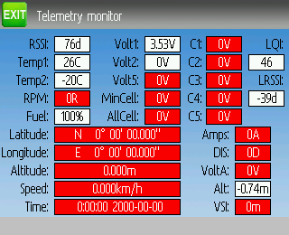

..

.. |mod-install-link| replace:: http://www.deviationtx.com/wiki/#hardware_modifications
.. |a7105-note| replace:: **NOTE:  This protocol requires the addition of an ‘A7105’ hardware module to function.  See the following document for more information**:
.. |cc2500-note| replace:: **NOTE:  This protocol requires the addition of an ‘CC2500’ hardware module to function.  See the following document for more information**:
.. |nrf24l01-note| replace:: **NOTE:  This protocol requires the addition of an ‘NRF24L01’ hardware module to function.  See the following document for more information**:
.. |nrf24l01p-note| replace:: **NOTE:  This protocol requires the addition of an ‘NRF24L01+’ hardware module to function.  Note the "plus" version of the nRF device is required to support the 250kbits/s data rate.  See the following document for more information**:

.. _protocols:

Protocols
=========
Some protocols have additional customization or limits.  Each of the protocols is described below.  An asterisk (‘*’) before the protocol name in the section header means a hardware module must be added to the transmitter to support the protocol.  On the transmitter display the asterisk means Deviation does not detect the required module (not installed, hardware.ini not correct, or other issue communicating with the module.)  More information can be found in the Module installation guide:

|mod-install-link|

Protocol: DEVO
--------------
The DEVO protocol is used to maintain compatibility with the Walkera DEVO receivers/models.  This protocol supports up to 12 channels.  The DEVO protocol supports both auto-binding and manual-binding.  If Fixed ID is set to ‘None’ the transmitter will attempt to auto-bind with the receiver every time it is powered on.  If a value is set for Fixed ID, the receiver must be bound manually one-time using the ‘Bind’ button, after which it should stay bound.  Note that the Fixed ID is only part of the binding procedure.  Two transmitters with the Same ID cannot control the same model.

.. image:: images/|target|/ch_protocols/devo.png
   :align: center

The DEVO protocol also supports enabling/disabling the telemetry capability.  This option is accessed by pressing the Protocol spin-box when DEVO is shown. The options are Std (standard format), X350 (Walkera QR-X350 format), and Off.

The following fields are available in Devo Telemetry.  Note that not all models/receivers report all fields, and that some fields require extra modules to enable.

.. image:: images/|target|/ch_protocols/devo_telem.png
   :align: center

.. container::

   * **Temp1/2/3/4**: Temperature readings.  These can be battery, motor, or ambient values
   * **Volt1/2/3**: Voltage readings for receiver battery, and external batteries
   * **RPM1/2**: Motor/Engine RPM values
   * **GPS Data**: Current position, speed and altitude from GPS module

Protocol: WK2801
----------------
The WK2801 protocol is used to control older Walkera models.  The previous Walkera models were segmented into 3 similar but not identical protocols: WK2801, WK2601, WK2401.  This roughly corresponds to the number of channels supported, but many of the newer 6-channel receivers actually support the WK2801 protocol.  It is recommended to try the WK2801 protocol 1st when working with older Walkera models before attempting the WK2601 or WK2401 mode, as the WK2801 is a superior protocol.  The WK2801 protocol supports up to 8 channels, and both auto-binding and manual-binding.  If Fixed ID is set to ‘None’ the transmitter will attempt to auto-bind with the receiver every time it is powered on.  If a value is set for Fixed ID, the receiver must be bound manually one-time using the ‘Bind’ button, after which it should stay bound.

Protocol: WK2601
----------------
The WK2601 protocol is used to control older Walkera models.  The previous Walkera models were segmented into 3 similar but not identical protocols: WK2801, WK2601, WK2401.  This roughly corresponds to the number of channels supported, but many of the newer 6-channel receivers actually support the WK2801 protocol.  It is recommended to try the WK2801 protocol 1st when working with older Walkera models before attempting the WK2601 or WK2401 mode, as the WK2801 is a superior protocol.  The WK2601 protocol supports up to 7 channels, and only supports auto-binding.  The fixed ID can be used, but does not prevent auto-binding during power-on.

.. image:: images/|target|/ch_protocols/wk2601.png
   :align: center

The WK2601 protocol also supports additional options.  These are accessed by pressing the Protocol spin-box when Wk2601 is shown:

**Chan mode**: Sets how channels are processed:

* **5+1**: AIL, ELE, THR, RUD,  GYRO (ch 7) are proportional.  Gear (ch 5) is binary.  Ch 6 is disabled
* **Heli**: AIL, ELE, THR, RUD, GYRO are proportional.  Gear (ch 5) is binary. COL (ch 6) is linked to Thr.  If Ch6 >= 0, the receiver will apply a 3D curve to the Thr.  If Ch6 < 0, the receiver will apply normal curves to the Thr.  The value of Ch6 defines the ratio of COL to THR.
* **6+1**: AIL, ELE, THR, RUD,  COL (ch 6), GYRO (ch 7) are proportional.  Gear (ch 5) is binary.  This mode is highly experimental.
* **COL Inv**: Invert COL servo
* **COL Limit**: Set maximum range of COL servo

Protocol: WK2401
----------------
The WK2401 protocol is used to control older Walkera models.  The previous Walkera models were segmented into 3 similar but not identical protocols: WK2801, WK2601, WK2401.  This roughly corresponds to the number of channels supported, but many of the newer 6-channel receivers actually support the WK2801 protocol.  It is recommended to try the WK2801 protocol 1st when working with older Walkera models before attempting the WK2601 or WK2401 mode, as the WK2801 is a superior protocol.  The WK2401 protocol supports up to 4 channels, and only supports auto-binding.  The fixed ID can be used, but does not prevent auto-binding during power-on.

.. _protocol-dsm2:

Protocol: DSM2
--------------
The DSM2 protocol is used to control many Spektrum™ and JR™, as well
as other models using this protocol.  The DSM2 protocol can
support up to 12 channels.  Note that many receivers with less than 8 channels require the
Transmitter to send 7 or fewer channels.  Make sure the # of channels
is set appropriately for the receiver.  DSM2 does not support
auto-binding.  If Fixed ID is set to None, a transmitter-specific ID
is used instead.  It is necessary to manually bind each model before
the first use.

Note that binding does not exit until you move the AIL or ELE
controls. This is so you can press the Failsafe button on some DSM
receivers to set the failsafe value.

.. image:: images/|target|/ch_protocols/dsm2.png
   :align: center

The DSM2 protocol also supports enabling/disabling the telemetry capability.  This option is accessed by pressing the Protocol spin-box when DSM2 is shown.

.. image:: images/|target|/ch_protocols/dsm_telem.png
   :align: center

.. container::

   The following fields are available in DSM2 Telemetry.  Note that a dedicated telemetry module and additional sensors are needed to capture this data

   * **FadesA/B/L/R**: The number of times each antenna has received a weak signal.  Ideally these numbers should all be similar, indicating even reception to each antenna
   * **Loss**: The number of times complete signal loss (dropped frame) occurred
   * **Holds**: The number of times the receiver entered fail-safe mode due to loss of signal
   * **Volt1/2**: Battery voltage for receiver and an external source
   * **RPM**: Engine/Motor speed
   * **Temp**: Temperature from external temperature sensor
   * **GPS Data**: Current position, speed and altitude from GPS module

Protocol: DSMX
--------------
The DSMX protocol is used to control many Spektrum™ and JR™, as well as other models using this protocol.  The DSMX protocol can support up to 12 channels.  Note that many receivers with less than 8 channels require the Transmitter to send 7 or less channels.  Make sure the # of channels is set appropriately for the receiver.  DSMX does not support auto-binding.  If Fixed ID is set to None, a transmitter-specific ID is used instead.  It is necessary to manually bind each model before the first use.

Note that binding does not exit until you move the AIL or ELE
controls. This is so you can press the Failsafe button on some DSM
receivers to set the failsafe value.

Note that unlike Spektrum™ or JR™ transmitters, Deviation will not automatically select between DSM2 and DSMX.  The user must select which protocol to use.

.. image:: images/|target|/ch_protocols/dsmx.png
   :align: center

The DSMX protocol also supports enabling/disabling the telemetry capability.  This option is accessed by pressing the Protocol spin-box when DSMX is shown.

The list of DSMX telemetry fields is identical to those in the DSM2 Protocol, and are documented in section :ref:`protocol-dsm2`.

Protocol: J6Pro
---------------
The J6Pro protocol is used to support Nine Eagles™ models.  Only models compatible with the J6Pro transmitter can be used.  Many older 4-channel Nine Eagles models used a different protocol that is unsupported.  The J6Pro protocol supports up to 12 channels, although only models with 6 channels have been tested.  J6Pro does not support auto-binding.  If Fixed ID is set to None, a transmitter-specific ID is used instead.  It is necessary to manually bind each model before the first use.

Protocol: WFLY
-------------------------
The WFLY protocol supports WFLY receivers such as WFR04S, WFR07S and WFR09S.

The protocol supports up to 9 channels.  Default channel order is AETR.

Protocol: \*Flysky
------------------
The Flysky protocol is used to control Turnigy/Flysky receivers as well as a few other models using the same AFHDS protocol (WL V911, Xieda 9958, etc).  |a7105-note|

|mod-install-link|

The Flysky protocol supports up to 12 channels, and both auto-binding
and manual-binding.  If Fixed ID is set to ‘None’ the transmitter will
attempt to auto-bind with the receiver every time it is powered on.
If a value is set for Fixed ID, the receiver must be bound manually
one-time using the ‘Bind’ button, after which it should stay bound.

The Flysky protocol also supports WLToys extensions to the protocol.
These are accessed by pressing the Protocol spin-box when Flysky is
shown:

**V9x9**: Enables the extensions for the WLToys V939, V949, V959,
v969, etc quadcopters.

* Lights are controlled by Channel 5
* Video is controlled by Channel 6
* Camera is controlled by Channel 7
* Flip is controlled by Channel 8

**V6x6**: Enables the extensions for the WLToys V636 and V686 quadcopters.

* Lights are controlled by Channel 5
* Flip is controlled by Channel 6
* Camera is controlled by Channel 7
* Video is controlled by Channel 8
* Headless mode is controlled by Channel 9
* RTH mode is controlled by Channel 10
* X and Y calibration are controlled by channels 11 and 12, respectively.

**V912**: Enables the extensions for the V912, V913 and V915 helicopters

Note that if these channels are assigned to a switch, turning the switch on toggles the state, and turning the switch off has no effect.  Thus to turn the lights on, flip the switch assigned to Channel 5 from off to on.  Flipping the switch back to off has no effect.  Flipping the switch back on now turns the lights back off.

Protocol: \*AFHDS-2A
--------------------
The AFHDS-2A protocol is used to control Turnigy/Flysky AFHDS 2A receivers.  |a7105-note|

|mod-install-link|

The AFHDS-2A protocol supports up to 14 channels, and requires manual-binding.
The receiver must be bound manually one-time using the ‘Bind’ button, after which it should stay bound.

Options configurable on the AFHDS-2A page:

* **Outputs**: Sets desired outputs type on the receiver, PWM+IBUS, PPM+IBUS, PWM+SBUS or PPM+SUBS
* **Servo Hz**: Sets receiver PWM refresh rate between 50 Hz and 400 Hz
* **LQI output**: Output LQI to an optional channel
* **Freq-fine**: Frequency offset adjustment. Range -300 to 300. Adjusts for variances betweeen A7105 modules. Default 0. The LQI telemetry value can be used as a guide for adjusting the fine frequency protocol option.

Telemetry is supported.

Protocol: \*Hubsan4
-------------------
This protocol is used on the Hubsan-X4 quadracopters of the H107 series, H111, H101, H102, H201, H202 helicopters and the Estes Proto X (but not the Proto X SLT). (regular format).

This protocol is used on Hubsan H301F, H302F, H303F and H304F (H301 format)

This protocol is used on Hubsan H501S, H122D and H123D (H501 format)

|a7105-note| |mod-install-link|

.. image:: images/|target|/ch_protocols/hubsan.png
   :align: center

The Hubsan4 protocol supports up to 13 channels, regular format only supports auto-binding.  The fixed ID can be used, but does not prevent auto-binding during power-on.  The 1 st 4 channels represent Aileron, Elevator, Throttle, and Rudder.  Additional channels control the quadracopter special functions: 

With H301 and H501 format it is necessary to manually bind each model before the first use.

* Channel 5 Controls the LEDs
* Channel 6 Enables ‘flip’ mode or altitude hold or stabilized mode, depending on format.
* Channel 7 Turns video on/off (H102) or takes a snapshot
* Channel 8 Takes a snapshot
* Channel 9 Enables headless mode
* Channel 10 Enables return to home
* Channel 11 Enables GPS hold
* Channel 12 Sets Sport 1, Sport 2 or Acro mode (H123D)
* Channel 13 Enables ‘flip’ mode (H122D)

Options configurable on the Hubsan page:

* **vTX MHz**: Defines the frequency used by the Hubsan H107D video transmitter (Requires a 5.8GHz receiver capable of receiving and displaying video).
* **Telemetry**: Enable receiving of model battery voltage.
* **Freq-fine**: Frequency offset adjustment. Range -300 to 300. Adjusts for variances betweeen A7105 modules. Default 0.

Protocol: \*Joysway
-------------------
The Joysway protocol supports the Joysway Caribbean model yacht, and
the J4C12R receiver used in the Joysway Orion, Explorer, Dragon Force
65 model yachts and Force2 60 model catamaran. No other models or 
receivers have been tested with this protocol, including air versions
of the J4C12R.  |a7105-note|

|mod-install-link|

The Joysway protocol supports up to four channels, does not support
auto-binding, but will bind whenever a receiver requests binding. If
Fixed ID is set to None, a transmitter-specific ID is used instead. It
is necessary to bind each model before the first use.

The first channel normally controls the sheets and the second channel
the rudder, but this may vary from model to model.

Protocol: \*Bugs3
------------------
The Bugs3 protocol is used to control MJX Bugs3 and Bugs8 aircraft.  |a7105-note| |mod-install-link|

To bind first choose the bugs3 protocol and click Bind.  Then apply power to the aircraft.
The bind dialog will disappear if bind is successful.  The aircraft's radio id is stored in the model
Fixed ID field.  Do not change this value.

Channels used for controlling functions. Set channel value greater than zero to activate.

* Arming is controlled by Channel 5
* Lights are controlled by Channel 6
* Flip is controlled by Channel 7
* Camera is controlled by Channel 8
* Video is controlled by Channel 9
* Angle/Acro mode is controlled by Channel 10 (>0 is Angle)

Telemetry is supported for RSSI and voltage alarm. It uses the Frsky telemetry display with
signal strength reported in the RSSI field and battery voltage in VOLT1.
The bugs3 receiver only reports good/bad voltage. This is translated to VOLT1 values
of 8.4V for good and 6.0V for low voltage.

Protocol: \*Frsky-V8
--------------------
The Frsky-V8 protocol is used to control older Frsky™ receivers using the one-way protocol. |cc2500-note|

|mod-install-link|

The Frsky-V8 protocol supports 8 channels, does not support auto-binding.  If Fixed ID is set to None, a transmitter-specific ID is used instead.  It is necessary to manually bind each model before the first use.

Protocol: \*Frsky
-----------------
The Frsky protocol is used to control newer (telemetry enabled) Frsky™ receivers using the two-way protocol (D8). |cc2500-note|

|mod-install-link|

The Frsky protocol supports up to 8 channels, does not support auto-binding.  If Fixed ID is set to None, a transmitter-specific ID is used instead.  It is necessary to manually bind each model before the first use.

The Frsky protocol also supports enabling/disabling telemetry.  This option is accessed by pressing the Protocol spin-box when Frsky is shown.

When telemetry is enabled the values sent by the receiver (RSSI, VOLT1, VOLT2) are supported.

Additional Hub telemetry values are supported in common with the FrskyX protocol on transmitters except the 7e and f7.  See the Frsky Telemetry section below.

Protocol: \*FrskyX
------------------
The FryskyX protocol implements the Frsky D16 radio protocol, including S.Port and hub telemetry.

|cc2500-note| |mod-install-link|

This protocol supports up to 16 channels. Fixed ID binding is supported to link the transmitter with specific receivers. Supports receiver telemetry (RSSI, VOLT1) on all transmitters.  Supports S.Port and hub telemetry sensors as well as GPS telemetry (except on memory-limited 7e and f-series) as described in the next section.

The following protocol options are available.

**Freq-fine**: Frequency offset adjustment. Range -127 to 127. Adjusts for variances betweeen CC2500 modules. Usually offset of 0 or -41 is required, but full range should be tested if there are problems with binding or range.  Default 0. The LQI telemetry value can be used as a guide for adjusting the fine frequency protocol option.

**AD2GAIN**: The VOLT2 telemetry value (AIN input on X4R) is multiplied by this value divided by 100. Allows adjustment for external resistor divider network.  Default 100 (gain of 1). Range is 1 to 2000 (gain of 0.01 to 20.00).

**Failsafe**: The Frsky failsafe options are fully supported. If the channel failsafe (in mixer channel config) is set this value is sent to the receiver every 9 seconds.  The receiver will use these values in failsafe mode unless the protocol option is set to RX.

**Format**: Set the format to match the firmware in the receiver.  Both FCC and EU.  The EU version is compatible with the Frsky LBT firmware, but does not actually perform the LBT test.

**RSSIChan**: When set to LastChan the received RSSI will be transmitted on the last radio channel. The last channel is based on the # of Channels setting in the model. The channel value is the received RSSI value multiplied by 21.

**S.Port Out**: When enabled received s.port packets are echoed to the trainer port and extended voice is disabled.

For channels with failsafe set to off, the default Failsafe protocol option "Hold" commands the receiver to hold the last received channel values when the receiver enters failsafe mode.  The "NoPulse" setting causes the receiver to not send any signal on PPM outputs (Testing on X8R showed SBUS values went to minimum, but SBUS behavior is not specified by the protocol).  The "RX" setting prevents Deviation from sending failsafe settings so the receiver will use whatever failsafe values have been stored in the receiver.

When S.Port Out is enabled and PPMIn is not used, received S.Port packets are sent out the trainer port.  The bit rate is 57600 for compatibility with S.Port decoders, but the signal must be inverted to connect to a standard decoder.  It can be connected directly to the input of a 3.3V ftdi adapter.

*Frsky and FrskyX Extended Telemetry*
--------------------------------------
Extended telemetry refers to the hub and S.Port Frsky telemetry sensors.  These sensors are supported in all transmitters except the 7e.  They are available on the telemetry test pages and main page boxes.

The FrskyX S.Port telemetry provides for connecting up to 16 sensors of the same type (e.g. battery voltage).  Deviation supports multiple sensors of the same type, but only one telemetry value is saved.  The value most recently received from all the sensors of the same type is reported.

Telemetry values are reset on long press of the Up button while displaying the telemetry monitor page.  
For Frsky telemetry this resets the vario altitude "ground level" to the next received telemetry value, 
which zeroes the vario altitude telemetry value.  It also resets the battery discharge accumulator and minimum cell voltage.
The ground level value is saved in the model file to save the setting through
power cycles - the value is fairly constant during a single day of flying in stable air.

*Telemetry test page*

.. if:: devo8

The CELL voltages are labeled C1-C5.

.. endif::
.. if:: devo10

The following tables show the layout of the telemetry test page display.

.. cssclass:: telemtable

======== ======= =========
      Devo10
--------------------------
Misc     Bat     Cells
======== ======= =========
RSSI     VOLT1   CELL1
TEMP1    VOLT2   CELL2
TEMP2    VOLT3   CELL3
RPM      MINCELL CELL4
FUEL     ALLCELL CELL5
ALTITUDE VOLTA   CELL6
VARIO    CURRENT DISCHARGE
LQI      LRSSI
======== ======= =========

.. cssclass:: telemtable

======== ======= =========
       Devo7e
--------------------------
Misc     Bat     Signl
======== ======= =========
RSSI     VOLT1   LQI
\        VOLT2   LRSSI
======== ======= =========

.. endif::

The ALTITUDE value is reported as Above Ground Level.  The ground level is set to the first altitude telemetry value received.

The LQI (Link Quality Indicator) and LRSSI (Local RSSI) indicate the quality and signal strength of the telemetry signal from the receiver.  The LQI can be used as a guide for adjusting the fine frequency protocol option.  Lower LQI is better and values under 50 are typical.  The LRSSI units is (approximately) dBm.

Derived values: MINCELL is the lowest reported CELL value.  ALLCELL is the total of all reported CELL values.  Discharge is total battery discharge amount in milliAmp-hours.

Protocol: \*Skyartec
--------------------
The Skyartec protocol is used to control Skyartec™ receivers and models. |cc2500-note|

|mod-install-link|
 
The Skyartec protocol supports up to 7 channels, does not support auto-binding.  If Fixed ID is set to None, a transmitter-specific ID is used instead.  It is necessary to manually bind each model before the first use.

Protocol: \*Futaba S-FHSS
-------------------------
The Futaba S-FHSS protocol is used to control Futaba™ receivers and models. It also used by some models of XK Innovations and has third party compatible receivers available. |cc2500-note|

|mod-install-link|
 
The S-FHSS protocol supports up to 8 channels, and only supports auto-binding.  If Fixed ID is set to None, a transmitter-specific ID is used instead.  It is necessary to manually bind each model before the first use.

Traditional Futaba channel layout is following: Aileron, Elevator, Throttle, Rudder, Gear, Pitch, Aux1, and Aux2. So it is suitable for control of Collective Pitch (CP) helicopters.

Protocol resolution is 1024 steps (10 bits) out of which a bit smaller range is actually used (data by reverse engineering using third party equipment). Temporal resolution is 6.8ms. No telemetry supported.

 
Protocol: \*Corona
-------------------------
The Corona protocol supports Corona V1 and V2 receivers, and Flydream V3 receivers. |cc2500-note| |mod-install-link|

All the protocols support up to 8 channels.  Default channel order is AETR.  No telemetry in the protocols.

The following protocol options are available.

**Format**: Protocol selection. Use V1 and V2 with Corona receivers.  Use FDV3 for Flydream V3.

**Freq-fine**: Frequency offset adjustment. Range -127 to 127. Adjusts for variances betweeen CC2500 modules. Usually offset of 0 or -41 is required, but full range should be tested if there are problems with binding or range.  Default 0.

Protocol: \*Hitec
-------------------------
The Hitec protocol supports Optima and Minima receivers. |cc2500-note| |mod-install-link|

The protocol supports up to 9 channels.  Default channel order is AETR.  Telemetry is supported using the Frsky telemetry layout.  The following values are supported: VOLT1, VOLT2, CURRENT, TEMP1, TEMP2, FUEL, RPM, LRSSI, LQI, and GPS (latitude, longitude, altitude, speed, heading).  Receiver RSSI is not available in this protocol.

The following protocol options are available.

**Format**: Receiver selection for Optima or Minima.

**Freq-fine**: Frequency offset adjustment. Range -127 to 127. Adjusts for variances betweeen CC2500 modules. Usually offset of 0 or -41 is required, but full range should be tested if there are problems with binding or range.  Default 0.

Protocol: \*V202
----------------
The V202 protocol supports the WLToys V202 quadracopter. |nrf24l01-note|

|mod-install-link|

The V202 protocol supports up to 12 channels, does not support
auto-binding.  If Fixed ID is set to None, a transmitter-specific ID
is used instead.  It is necessary to manually bind each model before
the first use.

The 1 st 4 channels represent Aileron, Elevator, Throttle, and Rudder.  Additional channels control the quadracopter special functions: 

* Channel 5 controls the blink speed
* Channel 6 enables ‘flip’ mode
* Channel 7 takes still pictures
* Channel 8 turns video on/off
* Channel 9 turns headless mode on/off 
* Channel 10 causes the x axis to calibrate
* Channel 11 causes the y axis to calibrate

If JXD-506 format is selected, channels 10-12 are used for:

* Channel 10 start/stop
* Channel 11 emergency stop
* Channel 12 gimbal control

Also, models compatible with this format require the throttle stick to be centered before arming.

Protocol: \*SLT
---------------
The SLT protocol is used to control TacticSLT/Anylink receivers. |nrf24l01-note|

|mod-install-link|

The SLT protocol supports up to 6 channels, and only supports
auto-binding.  The fixed ID can be used, but does not prevent
auto-binding during power-on.

Protocol: \*HiSky
-----------------
The HiSky protocol is used to control HiSky brand models along with the WLToys v922 v955 models. |nrf24l01-note|

|mod-install-link|

The HiSky protocol supports up to 7 channels, does not support
auto-binding.  If Fixed ID is set to None, a transmitter-specific ID
is used instead.  It is necessary to manually bind each model before
the first use.

Protocol: \*YD717
-----------------
The YD717 protocol supports the YD717 and Skybotz UFO Mini quadcopters, plus several models from Sky Walker, XinXun, Ni Hui"), and Syma through protocol options. See the Supported Modules spreadsheet for a complete list. |nrf24l01-note|

|mod-install-link|

The YD717 protocol supports 9 channels and only supports auto-binding. The protocol stays in bind mode until successful. 

The first four channels represent Aileron, Elevator, Throttle, and Rudder. 

The fifth channel enables the auto-flip function when greater than zero. Additionally to enable auto-flips left and right the aileron channel scale must be 87 or greater. Likewise for the elevator channel and front/back flips. When auto-flip is enabled, moving the cyclic all the way in any direction initiates a flip in that direction. The YD717 requires at least four seconds between each auto-flip.

The sixth channel turns on lights when greater than zero.

The seventh channel takes a picture on transition from negative to positive.

The eighth channel starts/stops video recording on each positive transition.

The ninth channel is assigned to last feature flag available in the protocol.  This may control headless mode on models that have the feature.

Protocol: \*SymaX
-----------------
This protocol is used on Syma models: X5C-1, X11, X11C, X12, new X4, and new X6.  A variant supporting the original X5C and the X2 is included as a protocol option.  (The Syma X3, old X4, and old X6 are supported with the SymaX4 option in the YD717 protocol. ) See the Supported Modules spreadsheet for a complete list. |nrf24l01p-note|

|mod-install-link|

The SymaX protocol supports 9 channels and only supports auto-binding.

The first four channels represent Aileron, Elevator, Throttle, and Rudder. 

The fifth channel is unused.

The sixth channel enables the auto-flip function when greater than zero. 

The seventh channel takes a picture when the channel moves from negative to positive.

The eighth channel starts/stops video recording on each positive transition.

The ninth channel enables headless mode when positive.

Protocol: \*Hontai
------------------
This protocol is used on Hontai models F801 and F803.

|nrf24l01p-note| |mod-install-link|

The first four channels represent Aileron, Elevator, Throttle, and Rudder.  Additional channels control special functions: 

* Channel 5 is unused
* Channel 6 enables the flip function
* Channel 7 takes a picture on positive transition through zero
* Channel 8 turns video on/off on positive transition
* Channel 9 turns headless mode on/off 
* Channel 10 engages the return-to-home feature
* Channel 11 initiates calibration

Protocol: \*Bayang
------------------
This protocol is used on BayangToys X6, X7, X8, X9, X16, Boldclash B03, JJRC/Eachine E011, H8, H9D v2, H10, Floureon H101, JJRC JJ850, JFH H601, and H606 (regular format).

This protocol is used on BayangToys X16 with altitude hold (X16-AH format).

This protocol is used on IRDRONE Ghost X5 (IRDRONE format).

|nrf24l01p-note| |mod-install-link|

The first four channels represent Aileron, Elevator, Throttle, and Rudder.  Additional channels control special functions: 

* Channel 5 activates LEDs or inverted flight (Floureon H101)
* Channel 6 enables the flip function
* Channel 7 captures single photo on positive transition
* Channel 8 starts/stops video recording on positive transition
* Channel 9 turns headless mode on/off 
* Channel 10 engages the return-to-home feature
* Channel 11 enables Take Off/Landing
* Channel 12 activates emergency stop

Protocol: \*FY326
------------------
This protocol is used on FY326 red board.

|nrf24l01p-note| |mod-install-link|

The first four channels represent Aileron, Elevator, Throttle, and Rudder.  Additional channels control special functions: 

* Channel 5 is unused
* Channel 6 enables the flip function
* Channel 7 is unused
* Channel 8 is unused
* Channel 9 turns headless mode on/off 
* Channel 10 engages the return-to-home feature
* Channel 11 initiates calibration

Protocol: \*CFlie
-----------------
The CFlie protocol is used on the CrazyFlie nano quad. It has not been
tested with any other models. |nrf24l01p-note|

|mod-install-link|

The CFlie protocol supports up to 4 channels, does not support
auto-binding.  If Fixed ID is set to None, a transmitter-specific ID
is used instead.  It is necessary to manually bind each model before
the first use.

Protocol: \*H377
----------------
The H377 protocol supports the NiHui H377 6 channel helicopter. It has
not been tested with any other models. |nrf24l01-note|

|mod-install-link|

The H377 protocol supports up to 7 channels, does not support
auto-binding.  If Fixed ID is set to None, a transmitter-specific ID
is used instead.  It is necessary to manually bind each model before
the first use.

Protocol: \*HM830
-----------------
The HM830 protocol supports the HM830 Folding A4 Paper airplane. It
has not been tested with any other models. |nrf24l01-note|

|mod-install-link|

The HM830 protocol supports 5 channels and only supports
auto-binding. The protocol stays in bind mode until successful.

Protocol: \*KN
--------------
The KN protocol is used on the WLToys V930, V931, V966, V977 and V988 (WLToys format)
as well as the Feilun FX067C, FX070C and FX071C (Feilun format)
helicopters. It has not been tested with other models. |nrf24l01p-note|

|mod-install-link|

The KN protocol supports up to 11 channels and does not support
auto-binding.  If Fixed ID is set to None, a transmitter-specific ID
is used instead.  It is necessary to manually bind each model before
the first use.

Channels 1-4 are throttle, aileron, elevator and rudder.
Channel 5 activates the model's built-in dual rate.
Channel 6 activates throttle hold.
Channel 7 activates idle up (WL Toys V931, V966 and V977 only).
Channel 8 toggles between 6G (default) and 3G stabilization.
Channel 9-11 are trim channels for throttle/pitch, elevator and rudder.

Protocol: \*ESky150
-------------------
The ESky150 protocol supports the smaller ESky models from 2014 onwards
(150, 300, 150X). It has not been tested with any other models. |nrf24l01-note|

|mod-install-link|

The Esky150 protocol supports up to 7 channels, and does not support
auto-binding.  If Fixed ID is set to None, a transmitter-specific ID
is used instead.  It is necessary to manually bind each model before
the first use.

Channels 1-4 are throttle, aileron, elevator and rudder.
Channel 5 is flight mode  (1 bit switch with only two states).
Channel 6 is not yet used on any of the tested models.
Channel 7 is a 2 bit switch (4 states).

It is important if you have a 4 channel model, to configure that
your model only has 4 channels, otherwise the throttle values can
go crazy.

Protocol: \*Esky
----------------
Needs to be completed. |nrf24l01-note|

|mod-install-link|

The Esky protocol supports up to 6 channels, does not support
auto-binding.  If Fixed ID is set to None, a transmitter-specific ID
is used instead.  It is necessary to manually bind each model before
the first use.

Protocol: \*BlueFly
-------------------
The BlueFly protocol is used with the Blue-Fly HP100. It has not been
tested with any other models. |nrf24l01p-note|

|mod-install-link|

The BlueFly protocol supports up to 6 channels, does not support
auto-binding.  If Fixed ID is set to None, a transmitter-specific ID
is used instead.  It is necessary to manually bind each model before
the first use.

Protocol: \*CX10
----------------
The CX10 format supports the Cheerson CX10 quadcopter. |nrf24l01-note|

|mod-install-link|

The CX10 protocol supports 9 channels and only supports
auto-binding. The protocol stays in bind mode until successful. The
first four channels are Aileron, Elevator, Throttle and Rudder.

Channel 5 is Rate except on the CX-10A, where it is headless mode.

Channel 6 is flip mode.

The DM007 format also uses channel 7 for the still camera, channel 8
for the video camera and channel 9 for headless mode.

The protocol has a Format option for the Blue-A, Green, DM007,
Q282, JC3015-1, JC3015-2, MK33041 and Q242 quadcopters.

Protocol: \*CG023
-----------------
The CG023 protocol supports the Eachine CG023 and 3D X4 quadcopters. It has
not been tested on other models. |nrf24l01-note|

|mod-install-link|

The CG023 protocol supports 9 channels and only supports
auto-binding.

The first four channels are Aileron, Elevator, Throttle and Rudder.

Channel 5 controls the LEDs.

Channel 6 controls Flip mode.

Channel 7 controls the still camera

Channel 8 controls the video camera.

Channel 9 controls headless mode.

The protocol has a Format option for the YD829 quadcopter.

Protocol: \*H8_3D
-----------------
The H8_3D protocol supports the Eachine H8 3D, JJRC H20 and H11D quadcopters. It has
not been tested on other models. |nrf24l01-note|

|mod-install-link|

The H8_3D protocol supports 11 channels and only supports
auto-binding.

The first four channels are Aileron, Elevator, Throttle and Rudder.

Channel 5 controls the LEDs.

Channel 6 controls Flip mode.

Channel 7 controls the still camera

Channel 8 controls the video camera.

Channel 9 controls headless mode.

Channel 10 controls RTH mode.

Channel 11 controls camera gimball on H11D and has 3 positions.

Both sticks bottom left starts accelerometer calibration on H8 3D, or headless calibration on H20.

Both sticks bottom right starts accelerometer calibration on H20 and H11D.

Protocol: \*MJXq
-----------------
The MJXq protocol supports the MJX quadcopters. It also has format options for
Weilihua WLH08, EAchine E010 and JJRC H26D / H26WH. |nrf24l01-note|

|mod-install-link|

The MJXq protocol supports 12 channels and only supports
auto-binding.

The first four channels are Aileron, Elevator, Throttle and Rudder.

Channel 5 controls LEDs, or arm if H26WH format is selected.

Channel 6 controls Flip mode.

Channel 7 controls the still camera

Channel 8 controls the video camera.

Channel 9 controls headless mode.

Channel 10 controls RTH mode

Channel 11 controls autoflip (X600 & X800 formats) or camera pan

Channel 12 controls camera tilt

Protocol: \*Bugs3Mini
----------------------
The Bugs3Mini protocol is used to control MJX Bugs3 Mini and Bugs 3H aircraft.  |nrf24l01-note|

To bind first choose the Bugs3Mini protocol and click Bind.  Then apply power to the aircraft.
The bind dialog will disappear if bind is successful.

Channels used for controlling functions. Set channel value greater than zero to activate.

* Arming is controlled by Channel 5
* Lights are controlled by Channel 6
* Flip is controlled by Channel 7
* Camera is controlled by Channel 8
* Video is controlled by Channel 9
* Angle/Acro mode is controlled by Channel 10 (>0 is Angle)

Telemetry is supported for RSSI and voltage alarm. It uses the Frsky telemetry display with
signal strength reported in the RSSI field and battery voltage in VOLT1.
The Bugs3 Mini receiver only reports good/warning/low voltage. This is translated to VOLT1 values
of 8.40V for good, 7.10V for warning and 6.40V for low voltage.

Protocol: \*E012
----------------
The E012 protocol is used to control the Eachine E012 quadcopter.  |nrf24l01-note|

|mod-install-link|

The E012 protocol supports 10 channels and only supports
auto-binding.

The first four channels are Aileron, Elevator, Throttle and Rudder.

* Flip is controlled by Channel 6
* Headless mode is controlled by Channel 9
* RTH mode is controlled by Channel 10

Protocol: \*E015
----------------
The E015 protocol is used to control the Eachine E015 quad/car/boat.  |nrf24l01-note|

|mod-install-link|

The E015 protocol supports 10 channels and only supports
auto-binding.

The first four channels are Aileron, Elevator, Throttle and Rudder.

* Arming is controlled by Channel 5
* Led light is controlled by Channel 6
* Flip is controlled by Channel 7
* Headless mode is controlled by Channel 9
* RTH mode is controlled by Channel 10

Protocol: \*NCC1701
-------------------
The NCC1701 protocol is used to control the Air Hog Star Strek NCC-1701 quadcopter.  |nrf24l01-note|

|mod-install-link|

The NCC1701 protocol supports 5 channels and only supports auto binding.

The first four channels are Aileron, Elevator, Throttle and Rudder.

* Warp is controlled by Channel 5

Protocol: \*V911S
-----------------
The V911S protocol is used to control the WL Toys V911-S helicopter.  |nrf24l01-note|

|mod-install-link|

The V911S protocol supports 5 channels. The receiver must be bound manually one-time using the ‘Bind’ button, after which it should stay bound.

The first four channels are Aileron, Elevator, Throttle and Rudder.

* Calibration is controlled by Channel 5

Protocol: \*GD00X
-----------------
The GD00X protocol is used to control the C17 C-17 Transport and GD006 Diamond DA62 fixed wings.  |nrf24l01-note|

|mod-install-link|

The GD00X protocol supports 5 channels and only supports auto binding.

The first four channels are Aileron, Elevator, Throttle and Rudder.
Only throttle and aileron channels are used by the model.

* Lights are controlled by Channel 5

Protocol: PPM
---------------
The PPM protocol is used to output PPM on the trainer port.  It will disable all radio transmission.  PPM is useful for connecting to simulators, or other radio-modules that plug into the trainer port.  The Fixed ID has no effect, and there is no binding associated with this protocol.

.. image:: images/|target|/ch_protocols/ppm.png
   :align: center

.. container::

   Options configurable on the PPM page:

   * **Center PW**: Defines the time (in µsec) of the pulse that the transmitter transmits to represent to represent centered servo position.  If this number doesn’t match the master transmitter, the servos will not be centered.

   * **Delta PW**: Defines the width of the pulse (measured from center) sent by the transmitter to define max servo throw.  If this value is incorrect, the servos will not achieve full range (or will travel too much)

   * **Notch PW**: Defines the delay between the channels.

   * **Frame Size**: Defines the total time for all channels to be transferred. 

Deviation does not auto-detect when a trainer cord is plugged into the transmitter.  To use Deviation with a simulator (such as Phoenix), create a new model, name it appropriately, and select PPM as the protocol.  Use the Re-Init button or power-cycle to enable PPM.

.. _protocol-ppm:

Protocol: USBHID
----------------
The USBHID protocol will convert he transmitter into a USB joystick.  Connecting the transmitter to a PC via the USB cable will enable the transmitter to be detected as a joystick by the computer. This may be used to enable the transmitter to control any simulators that support joystick input. Some initial calibration may be necessary and is accomplished via the control panel applet of your operating system.

Protocol: SBUS
----------------
The SBUS protocol sends serial data on the transmitter's trainer port (tip connector).  The trainer port ring is ground.
On the T8SG PLUS transmitter the serial data also appears on the top pin in the JR module bay.
The serial data is not inverted so an adapter may be needed for some SBUS equipment.
Up to sixteen channels are supported.
Data rate is 100kbps. Format is 8 data bits, even parity, two stop bits.

Protocol: CRSF (Crossfire)
--------------------------
The CRSF protocol sends Crossfire protocol serial data on the transmitter's trainer port (tip connector).  The trainer port ring is ground.
On the T8SG PLUS transmitter the serial data also appears on the top pin in the JR module bay.
To enable telemetry the serial input must be tied to serial output.  For the trainer port tie tip to ring1.
In the T8SG module bay tie the top and bottom pins together.
Up to sixteen channels are supported.

The CRSF bind and configuration operations are not yet supported.
Use a PC to bind the Crossfire module and receiver before using with Deviation.

Telemetry is not available on limited memory transmitters (7e, F4, F12).

*Telemetry test page*

.. if:: devo8

The CELL voltages are labeled C1-C5.

.. endif::
.. if:: devo10

The following tables show the layout of the telemetry test page display.

.. cssclass:: telemtable

======== ======= =========
      Devo10
--------------------------
 RX       TX      Bat 
======== ======= =========
RxRSSI   TxRSSI  VBATT
RSSI2    TxPOWER CURRENT
RxSNR    TxSNR   CAPACITY
RxQUAL   TxQUAL  FMODE
PITCH    ROLL    YAW
RFMODE
======== ======= =========

.. endif::

Protocol: PXX
--------------
The PXX protocol is an Frsky serial interface to their transmitter modules. Primarily useful for R9M and XJT modules in the JR bay of the T8SG Plus, but protocol is available on the serial port of other transmitters.

Up to 16 channels are supported. Telemetry (S.Port) is supported in the Frsky format for most transmitters. Due to memory constraints telemetry is not available in modular builds. Range check operation is supported. Module power setting is displayed as FCC/EU (e.g. 100/25mW).

Fixed ID is supported to link the transmitter with specific receivers. The Fixed ID corresponds to the receiver number in OpenTX to make sharing easier. Values 0 to 63 are valid. Fixed IDs above 63 are truncated to the valid range.

The following protocol options are available.

**Failsafe**: If the channel failsafe (in mixer channel config) is set this value is sent to the receiver every 9 seconds.  The receiver will use these values in failsafe mode unless the protocol option is set to RX.
For channels with failsafe set to off, the default Failsafe protocol option "Hold" commands the receiver to hold the last received channel values when the receiver enters failsafe mode.  The "NoPulse" setting causes the receiver to not send any signal on PPM outputs (Testing on X8R showed SBUS values went to minimum, but SBUS behavior is not specified by the protocol).  The "RX" setting prevents Deviation from sending failsafe settings so the receiver will use whatever failsafe values have been stored in the receiver.

**Country**: Set the country to match the firmware in the receiver.  Options are US, JP, EU.

**Rx PWM out**: Choose whether PWM outputs of receiver are channels 1-8 or 9-16.

**Rx Telem**: Turn receiver telemetry on or off.

For transmitters without JR module the PXX signal is available on the serial port output.  This is normally the trainer jack except for the Devo12.  Use a stereo plug. Tip will be the PXX output, and ring is the s.port input. Sleeve is ground.

The T8SG V2 Plus requires a hardware modification to receive telemetry from a module in the JR bay.  The trainer port ring must be connected to the bottom JR pin (see picture).

