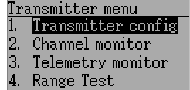
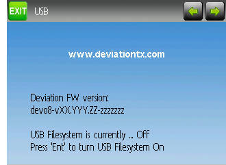

.. Transmitter menu chapter

Transmitter Menu
================

.. ignoreunless:: devo8

.. image:: images/devo8/ch_transmitter/tx_menu_conn.svg
   :width: 80%

.. stopignore::

Transmitter config
------------------

.. ignoreunless:: devo8

The configuration page defines various transmitter functions.  It is entered from the main menu via the TX Options icon. Please note that all screens in this section show the Deviation default settings.

.. image:: images/devo8/ch_transmitter/tx_config.png
   :width: 80%

.. stopignore::

.. ignoreunless:: devo10

The configuration page defines various transmitter functions.  It is entered from the main menu via ‘Transmitter menu’ followed by ‘Transmitter config’. Please note that all screens in this section show the Deviation default settings.

.. stopignore::

Generic settings
~~~~~~~~~~~~~~~~

.. ignoreunless:: devo10

.. image:: images/devo10/ch_transmitter/tx_config.png
   :width: 40%
   :align: right

.. stopignore::

.. container::

   **Language**: Select an appropriate language for all text.

   **Stick mode**: Select one of Mode 1-4. 

   * Mode 1 is common in Europe.  Elevator and Rudder on left, Throttle and Aileron on right.
   * Mode 2 is common in North America.  Throttle and Rudder on left, Elevator and Aileron on right.
   * Mode 3 has Elevator and Aileron on left, Throttle and Rudder on right
   * Mode 4 has Throttle and Aileron on left, Elevator and Rudder on right

   **Sticks**: Calibrate the range of all analog sticks and dials.

   To perform a stick calibration, highlight the Calibrate option and press the ENT button. Follow the on screen prompts for moving the sticks and confirming with the ENT button. 

.. ignoreunless:: devo8 
**Clock (Devo12 only)**: Set the current time and date
 
.. image:: images/devo8/ch_transmitter/clock.png
   :width: 80%

.. stopignore::

Buzzer settings
~~~~~~~~~~~~~~~

**Power On alarm**: Select the interval to be notified if your transmitter is on without action. Range is 0 – 60 minutes in 1 minute intervals. 

**Battery alarm**: Set battery voltage at which alarm will sound. The voltage range is 3.30V – 12.00V in 0.01V increments.

**Alarm interval**: Set frequency of alarm when battery is low. Alarm intervals can be set from 5 seconds to 1 minute in 5 second intervals. It may also be set to Off. 

**Buzz volume**: Set buzzer volume.  Available range is 1 – 10; the buzzer may also be set to None.

**Power-down alert**: Play sound at power-down.

LCD settings
~~~~~~~~~~~~

**Backlight**: Set screen brightness. Acceptable entries are from 1 to 10 and may also be turned off.

**Dimmer time**: Set delay before screen dimming. Times may be set from 5 seconds to 2 minutes in 5 second intervals. A setting of Off will force backlight to remain on as long as the transmitter is on.

**Dimmer target**: Set screen brightness when dimmed. Acceptable entries are from 1 to 10 and may also be turned off.

Timer settings
~~~~~~~~~~~~~~

**Prealert time**: Time before timer reaches zero to start beeping. Acceptable entries are from 5 seconds to 1 minute in 5 second intervals and may also be turned off.

**Prealert intvl**: How often to beep before timer reaches zero. Interval may be set from 1 – 60 seconds and may also be turned off.

**Timeup intvl**: How often to beep once timer has expired. Interval may be set from 1 – 60 seconds and may also be turned off.

Telemetry settings
~~~~~~~~~~~~~~~~~~

**Temperature**: Set units to display temperature for telemetry. Available options are Celsius and Fahrenheit.

**Length**: Set units to display length for telemetry. Selection choices are Meters and Feet.

Channel monitor
---------------

.. image:: images/|build|/ch_transmitter/channel_monitor.png
   :width: 40%
   :align: right

.. container::

   The channel monitor screen allows the user to see the values of each channel as output by the transmitter. Channel output displayed is the value based on minimum / maximum values as well as scaling. 

   **Example**: A channel scaled from -60 to +60 will only display the range of values from -60 to +60 depending on the stick position. 

Input Monitor
-------------

.. ignoreunless:: devo8

.. image:: images/devo8/ch_transmitter/input_monitor.png
   :width: 80%

.. image:: images/devo8/ch_transmitter/input_monitor2.png
   :width: 80%

.. stopignore::

.. ignoreunless:: devo10

.. image:: images/devo10/ch_transmitter/input_monitor.png
   :width: 40%
   :align: right

.. stopignore::

The input monitor screen shows the values associated with the current position of the control points. The values shown are a percentage of the total range of the controls based on a -100% to +100% scale. 

.. ignoreunless:: devo8

.. cssclass:: bold-italic

NOTE: Devo8 is limited to AIL, ELE, THR, RUD, RUD DR0/1, ELE DR0/1, AIL DR0/1, GEAR0/1, FMOD0/1/2, and MIX0/1/2

.. cssclass:: bold-italic

NOTE: Devo6 is limited to AIL, ELE, THR, RUD, DR0/1, GEAR0/1, FMOD0/1/2, and MIX0/1/2

Button Monitor
--------------

.. image:: images/devo8/ch_transmitter/button_monitor.png
   :width: 40%
   :align: right

.. container::

   The button monitor page is used to ensure physical buttons on the transmitter are working as expected.  Pressing any physical button will select the corresponding square on the screen.  To test ‘EXT’, ‘L-’ or ‘R+’ touch the screen to disable menu traversal.  Touch the screen again to unlock.

   .. cssclass:: bold-italic

   NOTE: Devo6 does not have the upper set of Trim L/R buttons

.. stopignore::

Telemetry monitor
-----------------

.. image:: images/devo8/ch_transmitter/telemetry_monitor.png
   :width: 40%
   :align: right

.. container::

   Certain protocols have the ability to transmit telemetry data back to the transmitter during use. Telemetry data may include, but is not restricted to, temperature readings, various voltage readings, motor or engine rpm, as well as GPS related information.

   Telemetry data is turned off by default for all supported protocols except DEVO.  See the corresponding 9 Protocols section to learn which protocols support telemetry, and identify which fields will be available.

.. image:: images/devo8/ch_transmitter/telemetry_monitor2.png
   :width: 40%
   :align: right

.. container::

   Since each protocol differs in the type of data it can return please see the original equipment manufacturers documentation concerning what additional hardware may be needed to collect this data. 

   Until valid data is transmitted the values will all be red

Range Test
----------

.. image:: images/devo8/ch_transmitter/range_test.png
   :width: 40%
   :align: right

.. container::

   It is recommended that you range test a new model before flying it the first time to verify that you will be able to control the model at normal flying distances. At some clubs, this is required as a safety measure. The range test page allows this.

   Once the range test page is opened, press the ‘Start test’ button to start the range test. The old and new power levels will be displayed.  The standard procedure is then to walk about 30 meters away, and verify that you still have control of the aircraft. You can then press the ‘Stop test’ button to end the range test and restore the configured radio power level. Pressing the ‘Ext’ button to exit the page will also restore the power level.

.. image:: images/devo8/ch_transmitter/range_test2.png
   :width: 40%
   :align: right

The radio range will be reduced by the square root of the change in power level. So going from 100mW to 100uW represents a change of power of roughly 1000, or a range reduction of a factor of a little over 30. So the normal range test of 30 meters would indicate that you should be able to control the model out to 900 meters. 

.. image:: images/devo8/ch_transmitter/range_test3.png
   :width: 40%
   :align: right

The installed RF module used for the current model must have a PA. If that is not the case, or the power level chosen for the model is already at the minimum value, a message to that effect will be displayed.

 
USB/About
---------

.. container::

   The USB page can be accessed by selecting ‘USB’ from the main menu. USB mode can then be toggled on/off to enable access to the transmitter’s file-system from a USB equipped computer. In this mode the file system of Deviation is accessible as a mass storage device. This will allow you to move files back and forth between the Deviation file-system and a PC. All configuration files are accessible in this mode.

   .. cssclass:: bold-italic

   NOTE: Entering USB mode should never be done while the model is bound, USB usage will disrupt signal transmission! 
